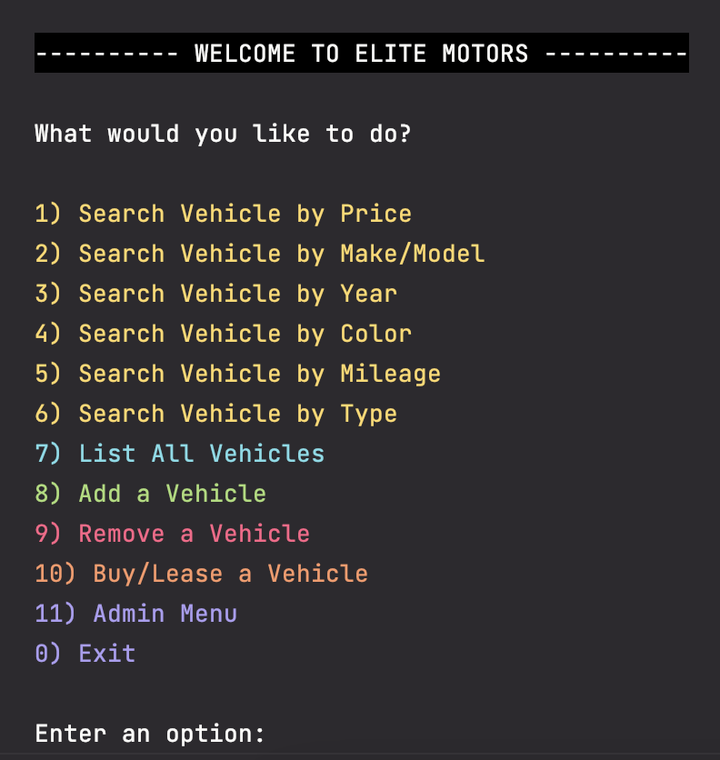

# CarDealership
**CarDealership** is an app that allows you to browse a virtual car dealership.
It allows you to list all vehicles, perform filtered searches, and add/remove vehicles.

## Features
- View all vehicles in the dealership
- Add/Remove vehicles to the dealership
- Search vehicles with various filters

## Home Screen
From the Home screen, you can choose one of the following:
- Search Vehicle by Price (range)
- Search Vehicle by Make/Model
- Search Vehicle by Year (range)
- Search Vehicle by Color
- Search Vehicle by Odometer (range)
- Search Vehicle by Type
- List All Vehicles
- Add Vehicle
- Remove Vehicle
- Buy/Lease a Vehicle
- Admin Menu
- Exit

## Listing All Vehicles
After selecting **List All Vehicles**, every single vehicle in the dealership will be displayed.

## Searching by Price
After selecting **Search Vehicle by Price**, you will be prompted for a minimum price and a maximum price.
A list of vehicles within that range will then be displayed.

## Searching by Make/Model
After selecting **Search Vehicle by Make/Model**, you will be prompted for the make and model.
A list of vehicles that have the specified make/model will then be displayed.

**NOTE**: You can enter both make & model, or just one if you leave the other blank.

## Searching by Year
After selecting **Search Vehicle by Year**, you will be prompted for a minimum year and a maximum year.
A list of vehicles within that range will then be displayed.

## Searching by Color
After selecting **Search Vehicle by Color**, you will be prompted for a color.
A list of vehicles with the specified color will then be displayed.

## Searching by Odometer
After selecting **Search Vehicle by Odometer**, you will be prompted for a minimum mileage and a maximum mileage.
A list of vehicles within that range will then be displayed.

## Searching by Type
After selecting **Search Vehicle by Type**, you will be prompted for a vehicle type.
A list of vehicles that are of the specified type will then be displayed.

## Adding a vehicle
After selecting **Add a Vehicle**, you will be prompted for the following:
- VIN
- Year
- Make
- Model
- Type
- Color
- Mileage
- Price

After entering valid information, you will receive confirmation that the vehicle was added.

### This is before we add the green Subaru Forester:

### Here is what it looks like after all information is entered in:

### This is after we added the green Subaru Forester:

## Removing a vehicle
After selecting **Remove a Vehicle**, all vehicles will be displayed.
You will then be prompted for the VIN of the vehicle you want to remove.

After entering a valid VIN, you will receive confirmation that the vehicle was removed.

### This is before we remove the RED Subaru Forester STI

### This is after we removed the RED Subaru Forester STI

## Buying/Leasing a vehicle
After selecting Buy/Lease a Vehicle, you will be prompted for the following:

- Date (YYYYMMDD)
- Vehicle VIN
- Full Customer Name
- Customer Email
- BUY or LEASE
- Financing? (Only if buying)

After entering a valid vehicle VIN, the entry for that vehicle will be shown to confirm your selection.

A confirmation message will be displayed after all valid information is entered,
along with full details for the contract.

### Buying & Financing Example:

### Leasing Example:

## Accessing the Admin Menu
After selecting **Admin Menu**, you will be prompted for the admin password, which is "password".

If the password is entered correctly, you will be presented with the Admin Menu that allows you to do the following:
- List All Contracts
- List All Sales Contracts
- List All Lease Contracts
- View Contract Details
- Back to Home screen

## Listing Contracts
When listing contracts, Sales contracts will appear in yellow, and Lease contracts in cyan.
At the bottom, it will tell you how many contracts it found in the system.

From the Admin Menu, you can choose to display All Contracts or just Sales/Leases.

### All Contracts

### All Sales Contracts

### All Lease Contracts

